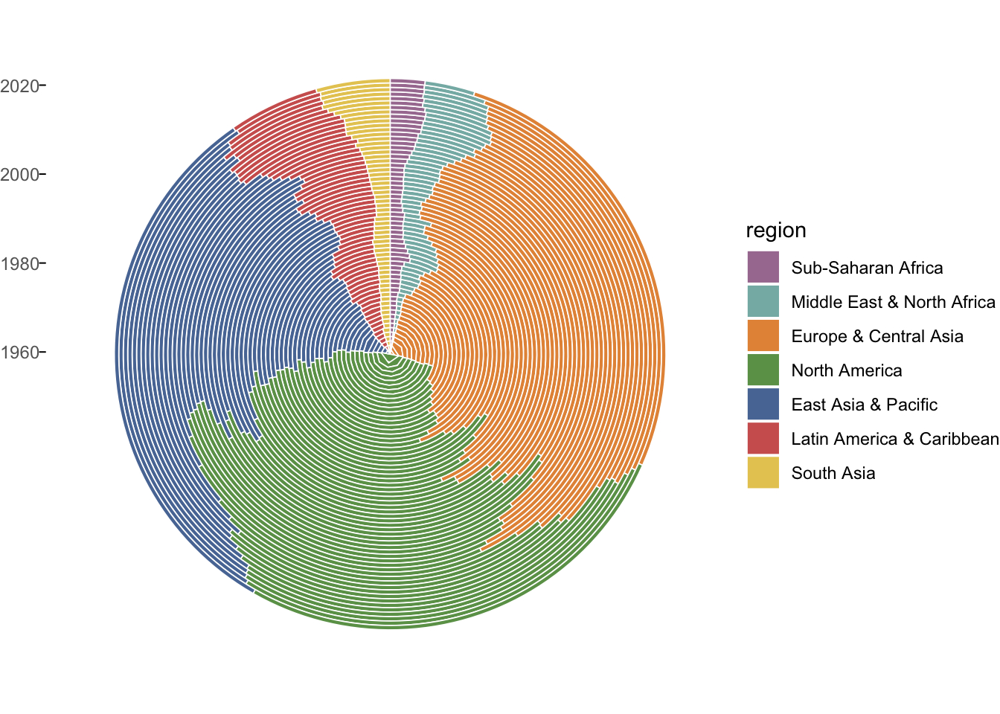

```{r setup, include=FALSE}
knitr::opts_chunk$set(echo = TRUE, message= FALSE, warning= FALSE)
library(altair)
library(reticulate)
#reticulate::py_config()
#altair::check_altair()
#altair::install_altair()
library("sf")
library(tidyverse)
library(countrycode)
library(plotly)
library(broom)
library(purrr)
library(readxl)
library(ggthemes)
library(tmap)
library(countrycode)

alt$data_transformers$disable_max_rows()


```

## Introduction

Given the background of currently steeply rising consumer prices and stock market instability we decided to look into economical data.
In this study we will analyse economical Data collected by the Worldbank which we put together ourselves through the worldbank api wrapped in the r-package "WDI".
We will first define a regional mapping to decrease the complexity of the data which is by country. 
Then we will have a look at the GDP in historical context on country and region level. Afterwards we will look into the relationship between economical and social indices such as HPI and the connection to inflation.
Finally we will have a deeper look into consumer price inflation.

## Region Mapping

To simplify the Data we will aggregate it by regions as defined by the Worldbank, which you can see below.
We also decided to use the same color scheme for all plots, which is tableau10 which you can as well see below.

```{r map,fig.width=12}

library(tmap)

#mappings = map_data("world")

pal = tableau_color_pal(
  palette = "Tableau 10")(10)

data("World")

World = World%>%
  filter(continent!="Antarctica")

World$wb=countrycode(sourcevar = World$iso_a3,
                        origin = "iso3c",
                         destination = "region")

World = World%>%
  filter(!is.na(wb))

tmap_mode("view")

tm_shape(World) +
    tm_polygons("wb",palette=pal)
# 
# ggplot(data = World) +
#     geom_sf(aes(fill=wb),color="white",size=.1)+
#     theme(legend.position = "none",x.axis.text="none")+
#     scale_fill_tableau()+
#     theme_igray() 

# tmap_mode("plot")
# 
# tm_shape(World) +
#     tm_polygons("wb",palette=pal)

```
## Historical GDP data
In this section, we will take a look at historical GDP data from 1960 to the most recent data from 2021 by the World Bank. To begin with, we look at animated data from the top 20 countries in terms of GDP volume over this time period using animated racing bar chart. Then we look at the development of GDP in the same period of time grouped by the regions. Counties are combined into regions according to World Bank, which were illustrated on the map in the previous section.

The GDP data itself were imported from World Bank database using API via WDI library.

### Racing Bar Chart 

```{r eval = FALSE, include=TRUE}

library(WDI)
library(dplyr)
library(tidyr)
library(sf)
library(rnaturalearth)
library(janitor)
library(ggplot2)
library(gganimate)
library(gifski)
library(ggimage)
library(av)
library(ggthemes)

start_year <- 1960
end_year <- 2021
worldbank_data = WDI("NY.GDP.MKTP.CD",  country = "all" ,start=start_year,end=end_year)

worldbank_data=worldbank_data%>%
  rename(gdp = `NY.GDP.MKTP.CD`)

world_regions <- ne_countries(scale = "medium", returnclass = "sf")%>%
  filter(sovereignt!="Antarctica")

gdp_ready <- worldbank_data%>%
  left_join(st_drop_geometry(world_regions[c("iso_a2","region_wb")]),by=c("iso2c"="iso_a2"))%>%
  rename(Region = region_wb)%>%
  drop_na()

rank_top <- 20

# Arrange the ranking
gdp_set <- gdp_ready %>%
  group_by(year) %>%
  mutate(rank = rank(-gdp),
         gdp_rel = gdp/gdp[rank==1],
         gdp_lbl = paste0(" ",round(gdp/1e9))) %>%
  group_by(country) %>%
  filter(rank <= rank_top) %>%
  ungroup()

gdp_set_2019 <- gdp_set %>%
  filter(year == 2019)

# Building the static plot
static_plot <- ggplot(gdp_set, aes(rank, group = country)) +  
  scale_fill_tableau(guide = guide_legend(title.theme = element_text(size = 30),
                                          label.theme = element_text(size = 25))) +
  geom_tile(aes(y = gdp/2,
                height = gdp, fill = Region,
                width = 0.9), alpha = 0.8, color = NA) +
  geom_text(aes(y = -2e12, label = paste(country)), vjust = 0.2, hjust = 1, size=7) +
  geom_flag(aes(y=-7e11, image = iso2c)) + 
  geom_text(aes(y=gdp,label = gdp_lbl, hjust=0), size=8) +
  geom_text(aes(x=rank_top, y=max(gdp) , label = as.factor(year)), vjust = 0.2, alpha = 0.5,  col = "gray", size = 20) +
  coord_flip(clip = "off", expand = FALSE) +
  scale_y_continuous(labels = scales::comma) +
  scale_x_reverse() +
  theme(axis.line=element_blank(),
        axis.text.x=element_blank(),
        axis.text.y=element_blank(),
        axis.ticks=element_blank(),
        axis.title.x=element_blank(),
        axis.title.y=element_blank(),
        panel.background=element_blank(),
        panel.border=element_blank(),
        panel.grid.major=element_blank(),
        panel.grid.minor=element_blank(),
        panel.grid.major.x = element_line( size=.1, color="grey" ),
        panel.grid.minor.x = element_line( size=.1, color="grey" ),
        plot.title=element_text(size=25, hjust=0, face="bold", colour="black", vjust=-1),
        plot.subtitle=element_text(size=18, hjust=1, face="italic", color="grey"),
        plot.caption =element_text(size=14, hjust=1, face="italic", color="grey"),
        plot.background=element_blank(),
        plot.margin = margin(2, 2, 2, 8, "cm"))

#static_plot

# Animating the static plot
animated <- static_plot + 
  transition_states(year, transition_length = 3, state_length = 0, wrap = FALSE) +
  view_follow(fixed_x = TRUE) +
  ease_aes('linear')+
  enter_fade()+
  exit_fade() +
  labs(title = paste("Top",toString(rank_top),"World GDP,",toString(start_year),"-",toString(end_year)),  
       subtitle  =  "GDP in Billions USD (constant 2010)",
       caption  = "Data Source: World Bank Data")

## Render the animated chart to mp4 and save
anim_save(
  filename = "gdp_barchart_race.mp4", 
  animation = animate(animated, 600,
                      fps = 20,
                      width = 1500,
                      height = 1000,
                      renderer = av_renderer()
                      )
)

```

As mentioned before, the animated graph shows top-20 countries by GDP volume from 1960 to 2021 according to World Bank data. The colors indicate the world regions.

The static plot was created using ggplot library, which then was rendered using gganimate library and finally converted to mp4 using av library. The country flags were added via the ggimage library.

In 1960, USA is the clear economical world power, which GDP is contantly growing with the time, but there are many other countries, which GDP is growing more rapidly, for example China, which GDP volume is currently almost caught up the USA's value. On the other hand, there are a number of european counties, which GDP is growing constantly, slower than China's but much faster then the USA's, which combined GDP volume is comparable high to that of the US and China.

<iframe width="720" height="480" src="gdp_barchart_race.mp4" align="middle" frameborder="0" sandbox></iframe>

### Historical GDP growth by region

```{r eval = FALSE, include=TRUE}

library(WDI)
library(dplyr)
library(tidyr)
library(sf)
library(rnaturalearth)
library(janitor)
library(ggplot2)
library(gganimate)
library(gifski)
library(ggimage)
library(av)
library(ggthemes)

start_year <- 1960
end_year <- 2021
worldbank_data = WDI("NY.GDP.MKTP.CD",  country = "all" ,start=start_year,end=end_year)

worldbank_data=worldbank_data%>%
  rename(gdp = 'NY.GDP.MKTP.CD')

world_regions <- ne_countries(scale = "medium", returnclass = "sf")%>%
  filter(sovereignt!="Antarctica")

gdp_ready <- worldbank_data%>%
  left_join(st_drop_geometry(world_regions[c("iso_a2","region_wb")]),by=c("iso2c"="iso_a2"))%>%
  rename(Region = region_wb)%>%
  drop_na()

library(plyr)

groupColumns <- c("Region","year")
dataColumns <- c("gdp")
gdp_regions <- ddply(gdp_ready, groupColumns, function(x) colSums(x[dataColumns]))

# Data for plot
gdp_regions$Region <- factor(gdp_regions$Region,
                             level = c('Sub-Saharan Africa',
                                       'Middle East & North Africa',
                                       'Europe & Central Asia',
                                       'East Asia & Pacific',
                                       'North America',
                                       'Latin America & Caribbean',
                                       'South Asia'
                                       )
                             )

gdp_tot <- sum(gdp_regions$gdp)

pdat = gdp_regions %>% 
  group_by(year) %>% 
  mutate(gdp_pct = gdp/sum(gdp)) %>% 
  arrange(Region) %>% 
  # Get cumulative value of cc
  mutate(gdp_cum = cumsum(gdp) - 0.5*gdp) %>% 
  mutate(gdp_pct_cum = cumsum(gdp_pct) - 0.5*gdp_pct) %>% 
  mutate(gdp_sum_year = sum(gdp)/1e9) %>% 
  ungroup

png(filename="polar_gdp_plot.png")
ggplot(pdat, aes(x=gdp_pct_cum, y=year, fill=Region, alpha=gdp_sum_year)) +
  geom_tile(aes(width=gdp_pct), colour="white", size=0.3) +
  coord_polar() +
  theme_void() +
  theme(axis.text.y=element_text(angle=0, colour="grey40", size=9),
        axis.ticks.y=element_line(),
        axis.ticks.length=unit(0.1,"cm")) +
  scale_alpha_continuous(range=c(0.5,1)) +
  scale_color_tableau() +
  scale_fill_tableau()
dev.off()
```

By looking at the circular plot, the shares of the individual regions can be estimated very well. In the 1960s, the GDP of the North American region was 50%, the European region had shares about 25% of the total, the other regions the remaining 25%. Over time, the share of the Northern American region in total GDP shrank to about a quarter. In the European region, there were three large jumps in GDP value during this period, with the share returning to the 1960 value. The East Asian region had a steady increase in GDP with the jump in the 1990s. The other regions had steady increases in share over the years.

{#id .class width=70% height=70%}

## Economic Indicators and relationship with well being

Economic indicator, such as GDP and GDP per capita, not only show a country’s economic performance as a whole as well as on an individual level. They are also strongly correlated with other important figures e.g., life expectancy, personal well-being and, to a lesser degree, with one’s happiness. In the following diagrams we will be showing the correlation between GDP / GDP per capita and before mentioned social economic indices.

```{r}

load("worldbankindicators.RData")

### manipulation of the datasets for further usage
# change country code in the World dataset with countrycode()
World$iso2c=countrycode(sourcevar = World$iso_a3,
                        origin = "iso3c",
                        destination = "iso2c")

World$wb=countrycode(sourcevar = World$iso_a3,
                        origin = "iso3c",
                         destination = "region")


World = World%>%
  filter(!is.na(wb))%>%
  filter(continent!="Antarctica")

# average of the indicators (inflation, GDP, Interest rate, Population, Unemployment) from the worldbank dataset
averaged_data <- worldbank_data%>%
  group_by(iso2c, country, Indicator)%>%
  summarise(Values=mean(Values,na.rm=T))

joined_average <- World%>%left_join(averaged_data, by='iso2c')

# filter by the most recent year, named here as 'current_data'
current_data <- worldbank_data %>% 
  filter(year==2000)

# join 'World' dataset with worldbank dataset
joined_data_2020 <- World%>%left_join(current_data, by='iso2c')

# filter only for inflation and unemployment
inflation <- filter(joined_data_2020, Indicator=='Inflation')
unemployment <- filter(joined_data_2020, Indicator =='Unemployment')

```


```{r}

joined_data_2020 %>% 
  ggplot(aes(x = (gdp_cap_est), 
             y = (life_exp),
             size= pop_est,
             )) +
  geom_point(alpha=0.1) +
  xlim(0,90000) +
  geom_smooth(span=1, se=F)+
  labs(title='life expectancy compared to GDP per capita for all countries in the year 2020',
       x = 'GDP per capita',
       y = 'Life expectancy',
       )

```

The positive relationship between life expectancy and GDP per capita can be clearly seen here. The jump in life expectancy is especially strong below the 25000$ threshold. After that the relationship starts to flatten.

```{r}

# life expectancy vs GDP per capita for each region defined by worldbank
joined_data_2020 %>% 
  ggplot(aes(x = (gdp_cap_est), 
             y = (life_exp),
             size= pop_est,
             color=wb
  )) +
  geom_point(alpha = 0.1)+
  xlim(0,60000) +
  geom_smooth(method=lm, se=F)+
  facet_wrap(~wb)+
  labs(title='Life expectancy and GDP per capita for Worldbank regions',
       x = 'GDP per capita',
       y = 'Life expectancy',
       colour = 'regions')+
  scale_color_tableau()


```

```{r}
# life expectancy vs GDP per capita for each region defined by worldbank
joined_data_2020 %>% 
  ggplot(aes(x = (gdp_cap_est), 
             y = (life_exp),
             size= pop_est,
             color=income_grp
  )) +
  geom_point(alpha = 0.1)+
  xlim(0,60000) +
  geom_smooth(method=lm, se=F)+
  facet_wrap(~income_grp)+
  labs(title='Life expectancy and GDP per capita divided by income level',
       x = 'GDP per capita',
       y = 'Life expectancy',
       colour = 'income level')

```

When the relationship are observed on a income level basis, there is a strong indication that income gain greatly raises the life expectancy. One could also argue that the positive relationship between those two variables are stronger in the developing nations than in the already developed nations.
Besides the obvious positive effect on life expectancy, we wanted to find out what other social economic effects GDP has.

```{r}

# HPI and GDP per capita for all countries between 2000-2020
joined_average %>% 
  ggplot(aes(x = log(gdp_cap_est), 
             y = HPI,
             size= pop_est,
  )) +
  geom_point(alpha = 0.1)+
  geom_smooth(method=lm, se=T)+
  labs(title='HPI and GDP per capita',
       x = 'GDP per capita',
       y = 'HPI',
       colour = 'continent')


```

Background information on HPI: The happy planet index consists of human well-being and its environmental impact. It can be described as an average of subjective life satisfaction, life expectancy at birth and ecological footprint per capita. In contrast to GDP and HDI （Human development index) it takes sustainability into account. The HPI was first introduced by 2006. Well-being, as the name suggests, is defined as what is ultimately good for a single individual, it is in the self-interest of the individual. The well-being index is developed by Mayo Clinic as an anonymous tool to allow participants to assess one’s well-being on various dimensions including ‘quality of life’, ‘meaning of work’, ‘likelihood of burnout, ‘suicidal ideation’ and more.
On the first sight there seems to be a small positive relationship between GDP per capita and HPI, meaning GDP per capita is not only a positive driver for longevity, but also general well-being and sustainability.

```{r}
# HPI and GDP per capita for each continent between 2000-2020
joined_average %>% 
  filter(continent %in% c('Asia', 'Africa', 'Europe', 'South America', 'Oceania', 'North America')) %>% 
  ggplot(aes(x = log(gdp_cap_est), 
             y = HPI,
             size= pop_est,
             color=wb
  )) +
  geom_point(alpha = 0.1)+
  geom_smooth(method=lm, se=T)+
  facet_wrap(~wb)+
  labs(title='HPI and GDP per capita',
       x = 'GDP per capita',
       y = 'HPI',
       colour = 'wb')+
  scale_color_tableau()


```

When seperated by worldbank regions, the relationship between the two variables becomes more muddy. One could argue that there is only a weak relationship or maybe even no relationship at all.

```{r}
# Life Expectancy And HPI
joined_average %>% 
  filter(continent %in% c('Asia', 'Africa', 'Europe', 'South America', 'Oceania', 'North America')) %>% 
  ggplot(aes(x = life_exp, 
             y = HPI,
             size= pop_est,
             color=pop_est_dens
  )) +
  geom_point(alpha = 0.1)+
  geom_smooth(method=lm, se=F)+
  labs(title='HPI and Life Expectancy',
       x = 'Life Expectancy',
       y = 'HPI')

```

Since GDP wasn’t a clear indicator for HPI, we started looking for other possible influences. One of such is the life expectancy. The positive relationship between those two was to be expected since since HPI contains life expectancy as a factor.

```{r}

# HPI vs Inequality for all countries
joined_average %>% 
  filter(continent %in% c('Asia', 'Africa', 'Europe', 'South America', 'Oceania', 'North America')) %>% 
  ggplot(aes(x = inequality, 
             y = HPI,
             size= pop_est,
             color=pop_est_dens
  )) +
  geom_point(alpha = 0.1)+
  geom_smooth(method=lm, se=F)+
  labs(title='HPI and Inequality',
       x = 'Inequality',
       y = 'HPI')

```

Another driver for HPI seems to be inequality. A negative relationship can be observed here, meaning the more equal a society/country is, the higher the HPI.

Besides GDP, we also wanted to look at inflation.

```{r}
# plotting inflation of year 2020
options(repr.plot.width = 2, repr.plot.height = 8)
joined_average %>% 
  filter(Indicator == 'Inflation') %>% 
  ggplot() +
  geom_sf(aes(fill=Values)) +
  colorspace::scale_fill_continuous_sequential(palette='Heat 2')+
  labs(caption= 'Average inflation between 2000 - 2020')
```

As one would suspect, Asia Pacific, Central/Western Europe and North America had stable inflation levels over the last 20 years. While Middle East and Eastern Europe are still doing alright, Latin America and Sub Saharan Africa are falling behind.

```{r}
## reshape long to wide for comparison between different indicators
#   wide_data_2020contains the indices values of 2020
columns <- c('iso_a3', 'wb','country', 'Indicator', 'Values', 'continent', 'economy', 'income_grp')
wide_data_2020 <- joined_data_2020[columns] %>% 
  st_drop_geometry() %>% 
  pivot_wider(names_from = Indicator, values_from = Values)

#   wide_averaged contains the averaged value of various indices for the last 20 years. (2000-2020)
wide_averaged <- joined_average[columns] %>% 
  st_drop_geometry() %>% 
  pivot_wider(names_from = Indicator, values_from = Values)

# average inflation rate vs average interest rate
wide_averaged %>% 
  ggplot(aes(y = log(Inflation), 
             x = `Interest Rate`,
             size= GDP,
  )) +
  geom_point(alpha=0.3)+
  geom_smooth(method=lm, se=F)+
  #facet_wrap(~continent)+
  labs(title='2000-2020 average inflation and interest rate for all countries',
       x = 'log(Inflation)',
       y = 'Interest Rate')

```

In economic theory the main tool to fight inflation is to raise the interest rate, meaning high interest rate leads to low inflation and vice versa. Using the average interest rate and average inflation rate in the last 20 years between 2000 and 2020 for all countries, the plot strangely show a positive relationship between interest rate and inflation, which is against all economic understanding. It appears that countries which on average have high level of inflation trying to fight the inflation with high interest rate, with somewhat mixed result. One could possibly conclude that interest rate alone might not be enough to regulate inflation issue.

```{r}
wide_averaged %>%
  ggplot(aes(y = log(Inflation), 
             x = Unemployment,)) +
  geom_point(alpha=0.3)+
  geom_smooth(method=lm, se=F)+
  labs(title='averaged Inflation and Interest rate between 2000 - 2020',
       x = 'unemployment rate',
       y = 'log(inflation)')

```

```{r}
wide_averaged %>%
  ggplot(aes(y = log(Inflation), 
             x = Unemployment,
             color= income_grp,)) +
  geom_point(alpha=0.3)+
  geom_smooth(method=lm, se=F)+
  facet_wrap(~income_grp)+
  labs(title='averaged Inflation and Unemployment separted by income level',
       x = 'unemployment',
       y = 'log(inflation)')

```

Another interesting macro economic theory is the relationship between unemployment rate and inflation, which basically argues that with full employment comes also high inflation. The data shows no clear results.

## Consumer Price Inflation in Detail

In this part we will have a detailed look at Consumer Price Inflation as collected by the Worldbank in the "A Global Database of Inflation" 
[https://www.worldbank.org/en/research/brief/inflation-database]

### Definitions

Besides Energy Price Inflation and Food Price Inflation we will also have a look at Headline and Core Inflation.

#### Headline inflation (CPI)

Headline inflation is the raw inflation figure reported through the Consumer Price Index (CPI) that is released monthly by the Bureau of Labor Statistics (BLS). The CPI calculates the cost to purchase a fixed basket of goods to determine how much inflation is occurring in the broad economy. The CPI uses a base year and indexes the current year's prices, according to the base year's values.

[https://www.investopedia.com/terms/h/headline-inflation.asp]

Note: When talking about inflation usually Headline inflation is meant.

#### Core Inflation

Core inflation removes the CPI components that can exhibit large amounts of volatility from month to month, which can cause unwanted distortion to the headline figure. The most commonly removed factors are those relating to the costs of food and energy. Food prices can be affected by factors outside of those attributed to the economy, such as environmental shifts that cause issues in the growth of crops. Energy costs, such as oil production, can be affected by forces outside of traditional supply and demand, such as political dissent.

[https://www.investopedia.com/terms/h/headline-inflation.asp]


### Inflation by worldbank regions

Below you can find a timeseries plot of median inflation rates by inflation index by worldbank regions.

```{r}

load("smoothts.RData")

selection = alt$selection_single(fields=list("region"), bind='legend')

chart <-
  alt$Chart()$
  encode(
    x=alt$X('date:T', axis=alt$Axis(title='Time')),
    strokeWidth=alt$value(3),
    y=alt$Y('smooth:Q', axis=alt$Axis(title='Annual Inflation Rate')),
    color=alt$Color("region:N",legend=alt$Legend(title="Worlbank Region")),
    tooltip=list('region:N','date:T'),
    opacity=alt$condition(selection, alt$value(1), alt$value(0.2))
  )$mark_line()$
  interactive()$
    add_selection(
    selection
  )

rule = alt$Chart(
)$mark_rule(color='red')$encode(
    y='ref:Q',
    strokeWidth=alt$value(4)
)

all = alt$layer(chart,rule,data=data)$facet('series',columns=2,title="Yearly Inflation Rates per month by Index and Worldbank Regions")

all

```

The faceted timeseries plot is extremely dense in information. 

The first thing to notice is that Energy Price and Food Price Inflation rates are much more volatile than the others. This especially applies to the Energy Price in North America region.

In general South Asia seems to have the highest Inflation Rates.

The spike in energy prices caused by recent events is especially visible in Europe and North America Regions. It is much greater than the last maximum spike during the global financial crisis around 2008, which caused spikes in inflation in all regions of the world and also affected all indicators, which seems to be a current trend as well. Such a clear global trend has not been visible in the data since the financial crisis in 2008.

This also leads to the observation that Headline Inflation Rates appear to be especially tied between five of the seven regions, which are East Asia & Pacific, Europe and Central Asia, North America, Latin America and Carribean as well as the Middle East. These are also the regions which in general have a inflation rate around two percent, which is supposed to be favourable for economies. 
The regions South Asia and Sub-Saharan Africa have higher inflation rates and also see spikes which seem not to appear in other regions. This especially visible in the Core Inflation Rates.

To go into more detail about the relationships we will now have a look at different correlations between the timeseries.

### Inflation Correlations

Note! It is "dangerous" to look at correlations of timeseries, as timeseries can have cross-correlation which means they are correlated but with a lag in time. This for example could be the case for energy and food prices where it looks like energy prices rise earlier than food prices. This will be investigated in the last secion.

But first we look at the pearson correlations calculated on the raw grouped data.

#### Correlations between Indicators per Region

```{r, fig.width=12}

m = data%>%
  select(region,series,value,date)%>%
  pivot_wider(id_cols=c(date,region),names_from=series,values_from=value)

korr = m%>%
  select(-date)%>%
  nest(data=-c(region))%>%
  mutate(korr = map(data,cor,use="pairwise.complete.obs"),
        tidied = map(korr, tidy))%>%
  unnest(tidied)


t = data.frame(
  series = rep(data$series%>%unique,data$region%>%unique%>%length),
  region = korr$region,
  corr = korr$x
)
colnames(t)[3:6]=data$series%>%unique

t_long=t%>%
  pivot_longer(!c(series,region))


alt$Chart(t_long)$mark_rect()$encode(
    x='series:N',
    y='name:N',
    #color='value:Q',
    color = alt$Color('value:Q', scale = alt$Scale(domain=list(-1,1),range = cm.colors(100))),
    tooltip = list("series:N","name:N","value:Q")
)$properties(width=200,height=200)$facet("region:N",columns=4)
```

From the correlation heatmaps we can see that the correlations are generally positive. Further there are distinguishable patterns for the regions.
For East Asia and Pacific the Core Consumer Price seems to be the least correlated with the other inflation rates.
The Headline Consumer Price seems to be strongly influenced by the Energy and Food Prices. 
In general North America and South Asia have "odd" patterns of Inflation when compared to other Regions. In both regions the correlation between Energy and Food Prices is extemely low. The Food Price also seems to have little Influence on the Headline Consumer Price Index. If we go back to the Timeseries plot above we can notice, that North America seems to have extremely low and stable Food Inflation Rates.

For further analysis we will look at a switched way of correlations by switching regions and indices.

#### Correlations between Regions per Indicator

```{r, fig.width=12}

m = data%>%
  select(region,series,value,date)%>%
  mutate(region2=region)%>%
  mutate(region=series,series=region2)%>%
  pivot_wider(id_cols=c(date,region),names_from=series,values_from=value)

korr = m%>%
  select(-date)%>%
  nest(data=-c(region))%>%
  mutate(korr = map(data,cor,use="pairwise.complete.obs"),
        tidied = map(korr, tidy))%>%
  unnest(tidied)


d = data%>%
  mutate(region2=region)%>%
  mutate(region=series,series=region2)

t = data.frame(
  series = rep(d$series%>%unique,d$region%>%unique%>%length),
  region = korr$region,
  corr = korr$x
)
colnames(t)[3:9]=d$series%>%unique

t_long=t%>%
  pivot_longer(!c(series,region))

alt$Chart(t_long)$mark_rect()$encode(
    x='series:N',
    alt$Y('name:N', axis=alt$Axis(ticks=FALSE, domain=FALSE)),
    color = alt$Color('value:Q', scale = alt$Scale(domain=list(-1,1),range = cm.colors(100))),
    tooltip = list("series:N","name:N","value:Q")
)$properties(width=300,height=300)$facet("region:N",columns=2)


```

In this part we will look into correlation between Price Indices between regions. When we look at the Headline Consumer Price Index we also see, what we saw above when we noticed that South Asia and Sub-Saharan Africa seem to be less correlated with the other regions. This however seems to be the case for North America as well, which we oversaw because it has generally low inflation rates. 
North America seems to have a rather strong connection to Europe & Central Asia however. 

If we next look at Core Consumer Inflation Rates Correlations we see,
that these have generally low correlations, which is probably the case because these are not clearly defined and can vary in their calculation depending on the regions.

When we look at Food Prices, we see that the Middle East & North Africa Food Prices are rather correlated with the Food Prices in East Asia, Europe and Latin America. Whereas Europe seems to have stronger correlations with the Middle East & North Africa as well as Latin America.

When looking at energy prices the correlation between East Asia & Pacific, Europe & Central Asia as well as Latin America & Carribean is once again visible.

The opposite seems to be the case for North America and South Asia as well as North America and Middle East & North Africa which seem to be generally weakly correlated.

### RWTLCC on LOESS interpolated data

In this last part we will look into the Rolling Windowed time lagged cross correlation between energy prices and food prices by regions as we saw surprising patterns by calculating the 
pearson correlation for North Amercia and South Asia above. I got inspired by this article: [https://towardsdatascience.com/four-ways-to-quantify-synchrony-between-time-series-data-b99136c4a9c9]

To get a smooth plot the data was interpolated using LOESS regression. 

How to read the plot: The data was interpolated so that it is weekly instead of monthly. Each row contains a window of 3 Years of the data. 
So the top row in the plot shows the subseries of the food and energy price inflation between 2006 and 2009. In each row the series will be shifted against each other by -18 and +18 months, this makes up the lag column.
From row to row of the heatmap the rolling window goes further by a quarter, so that the last shows the cross correlation of the data from 2019 to 2022.

The plot therefore shows us the change of correlation patterns between food prices and energy prices with respect to time.

```{r highres}

load("smoothts.RData")

s = seq(min(data$date),max(data$date),by="7 days")

t = data%>%
  mutate(series = word(`Series.Name`,1,-2))%>%
  nest(data = -c(region,series))%>% 
  mutate(
    test = map(data, ~ loess(.$value~as.numeric(.$date), span = .2)), # S3 list-col
    pred = map(test, predict,newdata = s)
  )%>%
  unnest(c(pred))
  
t$date=rep(s,length(data$region%>%unique)*length(data$`Series.Name`%>%unique))

t = t%>%select(-c(data,test))

dd2 = t%>%
  filter(series %in% c("Energy Price","Food Price"))%>%
  pivot_wider(id_cols=c(region,date),names_from=series,values_from=pred)

span_months = 18

t_start = 1
window_size = (span_months*2+1)*4
t_end = t_start + window_size
step_size = 3*4

rss= data.frame()

for(regions in dd2$region%>%unique){
  i=1
  t_start = 1
  t_end = t_start + window_size

  d = dd2%>%filter(region == regions)

  while (t_end< nrow(d)){
    d1 = d[t_start:t_end,"Energy Price"]
    d2 = d[t_start:t_end,"Food Price"]
    rs = ccf(d1,d2,lag.max=span_months*4,type="correlation",plot=F)
    rss = rbind(rss,cbind(regions,i,tidy(rs)))
    t_start = t_start + step_size
    t_end = t_end + step_size
    i = i+1
  }
}

alt$Chart(rss)$mark_rect()$encode(
    x=alt$X('lag:O', axis=alt$Axis(labels=F,ticks=F,domain=F)),
    y=alt$Y('i:N', axis=alt$Axis(labels=FALSE,ticks=F,domain=F,title='Time-Window')),
    color = alt$Color('acf:Q', scale = alt$Scale(domain=list(-1,1),range = cm.colors(100)),legend=alt$Legend(title="cross correlation")),
    tooltip = list("lag:N",alt$Tooltip('i:N', title="Time-Window"),"acf:Q")
)$properties(width=250,height=250)$facet(alt$Facet("regions:N",title=py_none()),columns=3,title="RWTLCC between LOESS interpolated energy and food price inflation rates by region between 2006 and 2022")
```

When we compare the results to the simple pearson correlation heatmap by region from earlier we get to see that the energy price in North America and South Asia are not actually weekly correlated.
They just show changing patterns of dependency where in South Asia the Energy Price as well as the Food Price can be the leading series depnding on the point in time.

In North America the energy prices tends to lead e.g. rise before the energy price. But it is shifting in how far it leads, so that the correlation without lag is positive as well as negative which means it's almost zero when the correlation is calculated without shifting.

Africa is the only region that tends to have the relationship the other way around, meaning that food prices rather lead, but only very slightly.
The other regions show rather complex patterns of cross correlation.

## Conclusion

We tried to use RStudio Cloud in the beginning which did not work that well for us because it was too complicated and unreliable. Also we played around with shiny too try out different regional mappings which 
was too complicated as well, as it is more sensible to stick with one regional mapping for our report. Which in this case, since we used economical data was the worldbanks regional mapping.
All of us learnt how to use ggplot which worked well for all of us as it also has great extensions like "ggimages" and "gganimate". We also got to use the "countrycodes" R-Package which solves the common problem of country mappings for different data elegantly. One of us decided to altair for the visualisations which was a bit tedious in the beginning but turned into good results in the end.


